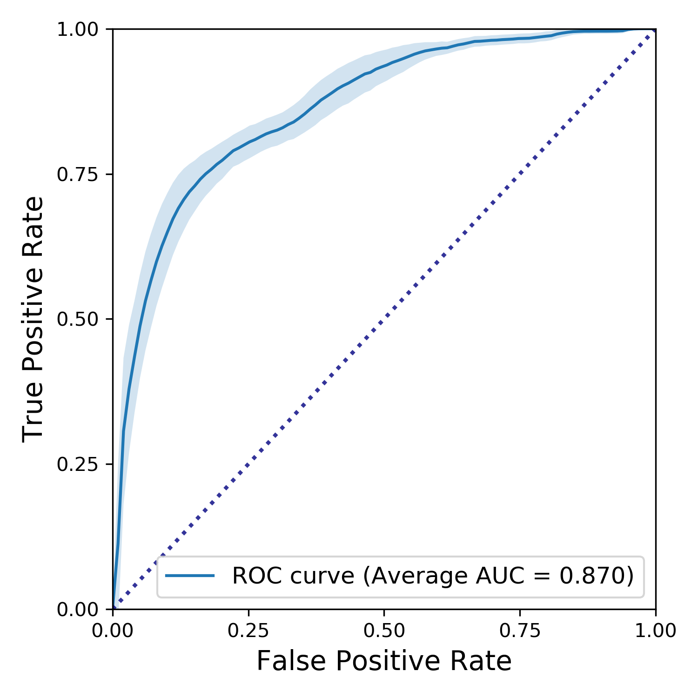
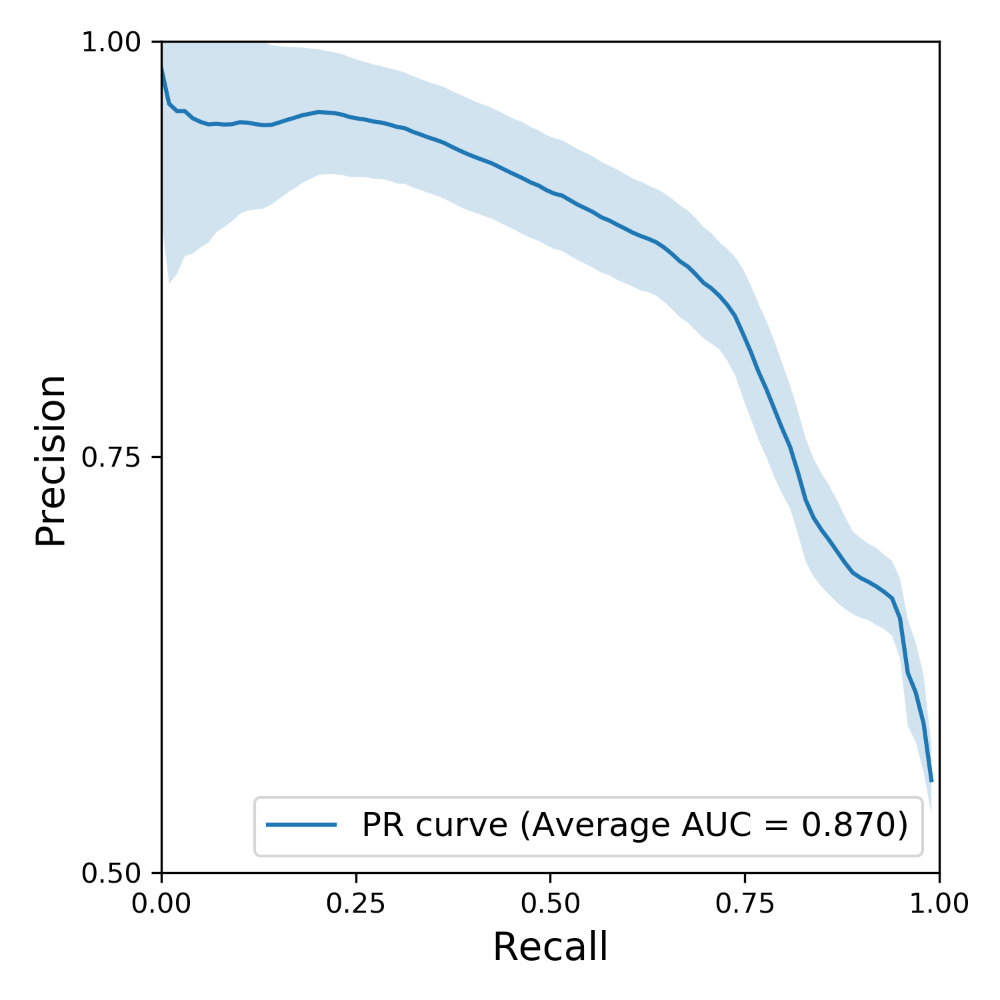
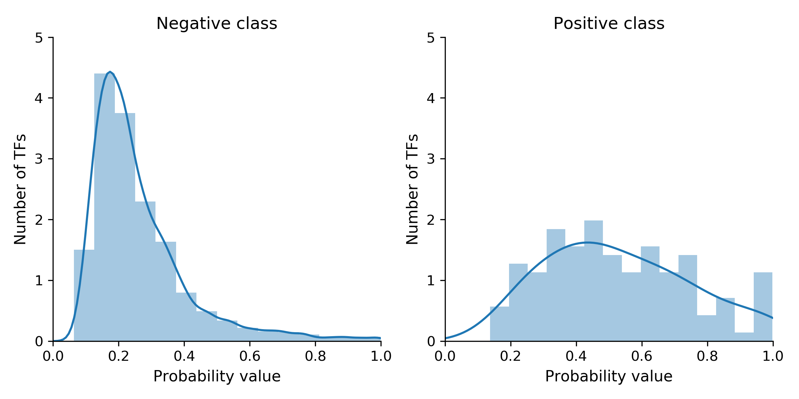

# TFdrive

_TFdrive_ is an algorithm for functional prediction of transcription factors (TF) driving differential gene expression. It uses a list of differentially expressed genes identified, e.g., by an RNA-seq or microarray analysis and returns a list of TFs ranked by the probability score. Currently _TFdrive_ library contains 173 human TFs.

## Method Details
Accurate predictions of TFs driving changes in gene expression is still a challenging task. Current methods are predominantly based on the available TF binding site data. However, the significance of a certain TF binding site often heavily depends on a cell type, experimental conditions and activity of other TFs. As a result, such methods tend to produce a lot of false positives. 
In contrast, _TFdrive_ predictions are based on an overlap of [KEGG pathways](https://www.genome.jp/kegg/pathway.html)/[GO terms](http://geneontology.org/) between differentially expressed genes (DEGs) and a TF. The algorithm takes into account relative pathway/term importance and the number of genes related to each of the overlapping pathways/terms. This data is further supplemented with the analysis of gene-TF association tables obtained from two manually curated databases, [TRANSFAC](https://amp.pharm.mssm.edu/Harmonizome/dataset/TRANSFAC+Curated+Transcription+Factor+Targets) and [ChEA](https://amp.pharm.mssm.edu/Harmonizome/dataset/CHEA+Transcription+Factor+Targets). These associations are predominantly inferred from TF binding site data. Considering that several TFs from the same family are often able to bind to the same motif, ratios between gene-TF association frequencies among DEGs vs. non-DEGs for each TF family are calculated using TRANSFAC and ChEA tables. Family-based scores appear to have more predictive value in this context than the scores calculated for individual TFs. As a next step, probability scores using previously created random forest model are calculated. Lastly, all the scores mentioned above are used to obtain the final probability score using logistic regression. Both random forest and logistic regression models were trained using the results of 443 human TF knockout/knockdown and overexpression experiments available at [ChEA3 website](https://amp.pharm.mssm.edu/chea3/). TFs, which were among DEGs, were considered to belong to the positive class.  
The data from [GSE50588](https://www.ncbi.nlm.nih.gov/geo/query/acc.cgi?acc=GSE50588) is used here to demonstrate _TFdrive_ predictive performance. This dataset contains the microarray results of 59 human transcription factors knockdowns. Differentially expressed TFs were assigned to the positive class. Although they presumably represent only a fraction of actual positives, the number of correctly identified TFs is expected to correlate with the number of all TFs involved in differential gene expression. Therefore, the results of such analysis may give a general impression regarding algorithm's predictive accuracy. Previously, this approach for model evaluation was employed in the development of ChEA3 (see this [publication](https://www.ncbi.nlm.nih.gov/pmc/articles/PMC6602523/) for details). Note that for testing purposes KEGG pathway/GO term information attributed to differentially expressed TFs was excluded from the analysis to avoid data leakage.
 
 

 

 
In summary, although _TFdrive_ is not designed to discover new TF-gene interactions, it allows to identify major players driving differential gene expression among known TFs in new experimental data with a high level of precision.

## Dependencies
_TFdrive_ supports Python 3.6+. Usage requires [numpy, scipy, pandas](https://www.scipy.org/), [pyarrow](https://github.com/apache/arrow), [scikit-learn](https://github.com/scikit-learn/scikit-learn), and [joblib](https://github.com/joblib/joblib).

## Installation
Download _tfdrive_files.7z_ from [here](https://drive.google.com/open?id=1hrzQ0xKb8LJKDUT8K5CDDVxw-AtfyFBy) (215 MB) and unpack _tfdrive.py_ and the _tfdrive_data_ folder to your project folder.

## Usage
After importing `tfdrive`, call `tfpred` providing a list of gene Entrez IDs as an argument. Currently, the method works only with human genes. `tfpred` returns a DataFrame object containing a ranked list of TFs with probability scores associated with them. The higher the score, the more likely the TF is to be involved in the observed changes in gene expression. Note that TFs from the library, which are found among DEGs, are excluded from the final results. 
To have a general idea of how the probability scores relate to the actual probability of TF involvement, consider their distribution in the example shown above:  
  
As you can see, the TFs with probability scores higher than 0.45 - 0.5 are much more likely to belong to the positive class than to the negative class.

## Future plans
- Increasing TF library and training dataset
- R library
- A model for prediction of mouse TFs
- Other tweaks to the algorithm

## License
This project is licensed under the MIT License - see the LICENSE.md file for details
